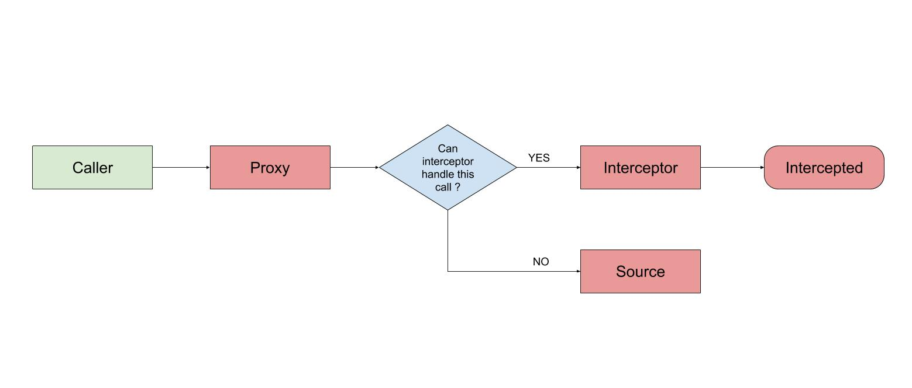

# STXMessageProxy

[](https://travis-ci.org/SteinX/STXMessageProxy)
[](https://cocoapods.org/pods/STXMessageProxy)
[](https://cocoapods.org/pods/STXMessageProxy)
[](https://cocoapods.org/pods/STXMessageProxy)

## Example

To run the example project, clone the repo, and run `pod install` from the Example directory first.

## Running Mode
1. interception mode


2. Broadcasting mode


## Usage
```objc
// Initialize from the source (the method call will be invoked on this object)
STXScrollDelegateProxy *proxy = [[STXScrollDelegateProxy alloc] initWithSource:self];

// If you have any selectors that you'd like to intercept, set the interceptor
proxy.interceptor = self.interceptor;

// If you have any broadcasting selectors, you can consider adding some subscribers to be notified
[proxy addBroadcastSubscriber:subscriber];

// Define the proxying policy for selector
[proxy setProxyingSelector:@selector(scrollViewWillBeginDragging:)
            withRunningMode:mode];
```

For a more concrete usage case, please refer to the Demo project.

## Installation

STXMessageProxy is available through [CocoaPods](https://cocoapods.org). To install
it, simply add the following line to your Podfile:

```ruby
pod 'STXMessageProxy'
```

## Author

SteinX, steinxia@gmail.com

## License

STXMessageProxy is available under the MIT license. See the LICENSE file for more info.


